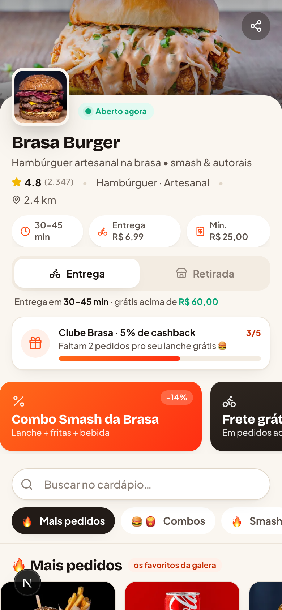
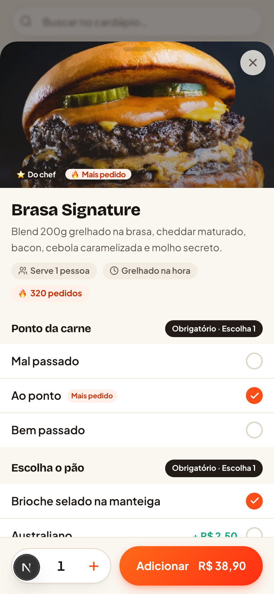
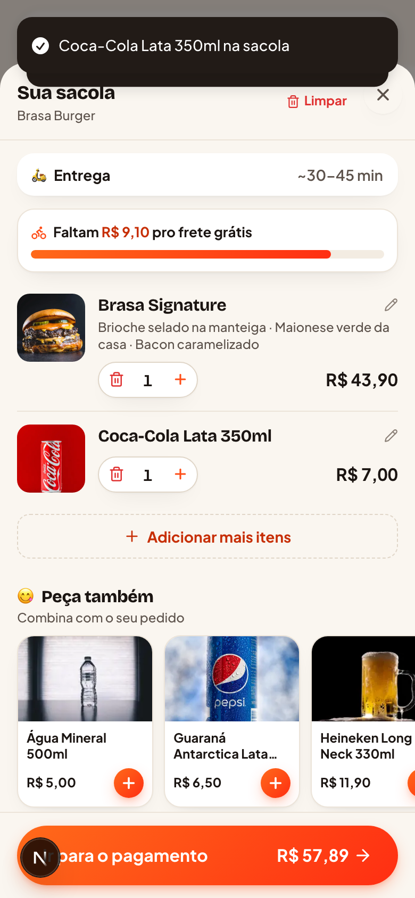
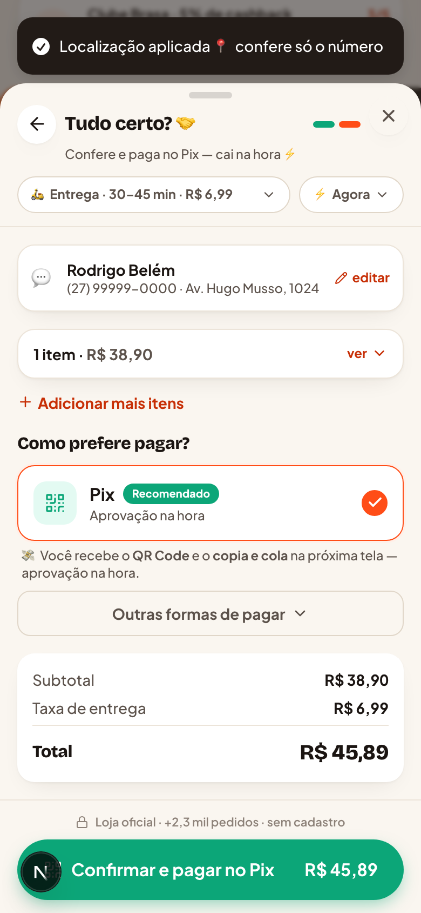
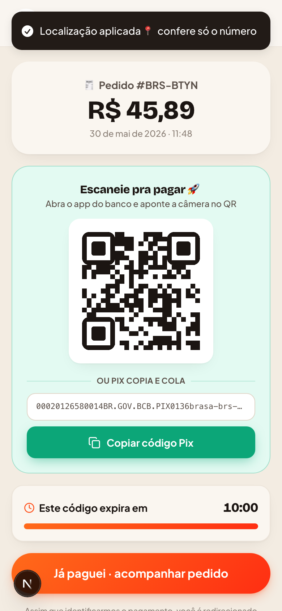
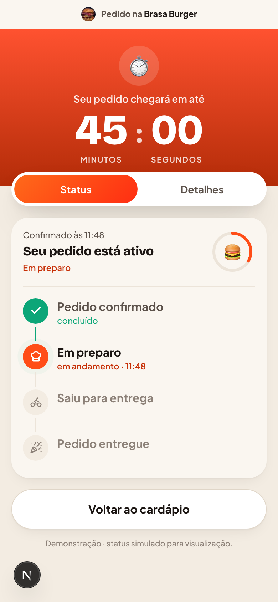

<div align="center">

# 🔥 Yooga OS · Cardápio Digital

### Um cardápio digital de delivery desenhado para a **maior conversão possível**

Demo de frontend (dados mockados) que destila o melhor de **8 benchmarks brasileiros** + **Owner.com** num fluxo fluido, rápido e sem fricção — **sem login**, do cardápio ao WhatsApp.

`Next.js 16` · `React 19` · `Tailwind v4` · `Zustand` · `Motion` · `TypeScript`

</div>

<div align="center">

| Cardápio | Produto | Sacola | Checkout | Pix | Acompanhamento |
|:---:|:---:|:---:|:---:|:---:|:---:|
|  |  |  |  |  |  |

</div>

---

## 🎯 O que é

Um **cardápio digital completo** (apenas frontend, 100% dados mockados) construído como referência de **CRO (conversion rate optimization)** para delivery no Brasil. A loja fictícia é a **Brasa Burger** (hamburgueria artesanal, Vila Velha/ES).

O cliente que faz o pedido **não cria conta** — informa apenas **nome, WhatsApp e endereço**, e só quando o tipo de serviço exige.

> 📓 As decisões de produto saíram de uma pesquisa multiagente dos benchmarks. O resultado completo está em **[`docs/PLAYBOOK-CONVERSAO.md`](docs/PLAYBOOK-CONVERSAO.md)**.

## 🛒 O fluxo (completo)

```
Cardápio → Detalhe do produto → Sacola → Checkout → Pix → Acompanhamento
 (home)     (customização)       (upsell)  (sem login) (timer)  (status ao vivo)
```

1. **Cardápio** — capa + logo + nota + status aberto, toggle Entrega/Retirada, busca, **tabs de categoria sticky com scroll-spy**, trilho "🔥 Mais pedidos", banners e barra de fidelidade.
2. **Detalhe** — bottom-sheet com foto grande, **adicionais com regras (obrigatório/opcional, min/máx)**, observações e **CTA que recalcula o total ao vivo**.
3. **Sacola** — barra sticky no rodapé, edição inline, **upsell "Peça também"**, **"faltam R$X pro frete grátis"**, cupom **auto-sugerido**, bloqueio de pedido mínimo.
4. **Checkout** — **bottom-sheet em 1–2 passos** (nunca troca de rota): endereço com **autofill por CEP** (vira card confirmado, só o número é digitado) → revisão com **Pix dominante**. Modo e agendamento viram **chips editáveis** no topo, total sempre colado no CTA. **Cliente recorrente abre direto na revisão = pedido em 1 toque.**
5. **Pagamento Pix** — tela dedicada com **QR + copia-e-cola + timer de 10 min** (pagamento na entrega pula direto pro acompanhamento).
6. **Acompanhamento** — tela premium com **countdown grande** e **status que evolui sozinho** (Pedido confirmado → Em preparo → Saiu para entrega → Entregue), com abas Status/Detalhes.

## ⚡ Princípios de conversão aplicados

- **Fricção mínima é dogma** — sem login, modo escolhido cedo, endereço só quando preciso.
- **PIX é rei** — método padrão, dominante, com QR + copia-e-cola na mesma tela (Owner.com: +6% no teste real).
- **Cada tela é alavanca de ticket (AOV)** — ancoragem de preço (de/por), adicionais que sobem o total ao vivo, upsell contextual, nudge de frete grátis.
- **Prova social inline** — badges "Mais pedido", contagem de pedidos, seção de favoritos no topo.
- **Sacola e checkout sempre visíveis** — barra sticky em toda navegação.
- **Transparência antecipada** — taxa e tempo de entrega visíveis cedo, matando o *sticker shock*.
- **First-party de ponta a ponta** — pedido fechado no canal próprio (sem comissão), pagamento Pix e acompanhamento de status on-site.

## 🧱 Stack & decisões

| Camada | Escolha | Por quê |
|---|---|---|
| Framework | **Next.js 16 (App Router, Turbopack)** | SSR/pre-render → first paint rápido e link rico no WhatsApp (supera SPAs de shell vazio) |
| UI | **Tailwind v4** (design system "Brasa") | Tokens quentes ember/charcoal/cream, mobile-first |
| Estado | **Zustand + persist** | Carrinho e dados do cliente sobrevivem ao refresh, sem backend |
| Animação | **Motion** | Bottom-sheets, micro-interações (bump no carrinho) |
| Ícones | **lucide-react** · Toaster: **sonner** | |

Detalhe de produto e sacola são **bottom-sheets** no mobile e **modal central / drawer lateral** no desktop — sem troca de rota, mantendo o scroll.

## 🚀 Rodando localmente

```bash
pnpm install
pnpm dev          # http://localhost:3000
pnpm build        # build de produção
```

## 📁 Estrutura

```
src/
├── app/                 # rotas: / · /checkout · /pedido
├── components/
│   ├── ui/              # Button, Sheet, Badge, TextField, QuantityStepper…
│   ├── menu/            # header, nav sticky, busca, cards, trilho de favoritos
│   ├── product/         # modal de detalhe + grupos de opções
│   ├── cart/            # barra sticky, drawer, upsell, cupom, frete grátis
│   ├── checkout/        # formulários, pagamento (Pix-first), agendamento
│   └── order/           # pagamento Pix (QR + timer) + acompanhamento do pedido
├── data/                # restaurant.ts · menu.ts (dados mockados)
├── store/               # Zustand (carrinho/cliente/UI) + cálculo de totais
├── lib/                 # tipos, formatação BR, carrinho, CEP mock, WhatsApp
└── hooks/               # useMounted, useMediaQuery, useScrollSpy
```

## 🍔 Trocando os dados

Todo o catálogo vive em **`src/data/`**:

- `restaurant.ts` — loja, taxas, horários, formas de pagamento, cupons.
- `menu.ts` — categorias, produtos e **grupos de opções reutilizáveis** (ponto, pão, adicionais, combos…).

As imagens reais estão em `public/img/`.

---

<div align="center">

Demonstração de produto · **Yooga OS** 🧡
Dados e pagamentos são fictícios.

</div>
